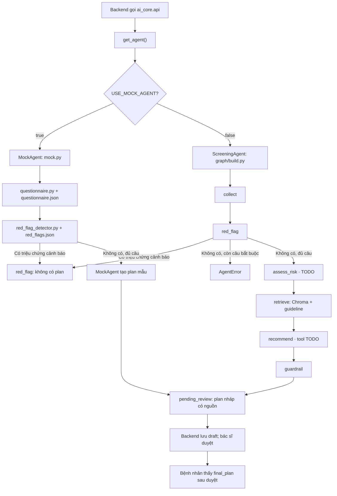

# Bản đồ file và use case của AI Core

Tài liệu này giải thích từng file trong `ai_core/` theo hai câu hỏi: **file làm gì?** và **khi nào nó được dùng?** Phần mô tả ý nghĩa giữ nguyên nội dung đã trao đổi; các use case và trạng thái hiện tại được bổ sung bên dưới.

## Luồng chính



`collect`, `red_flag`, `assess_risk`, `retrieve`, `recommend`, `guardrail` là **node của agent thật**. Backend giữ trạng thái phiên và quyết định lúc nào gọi `run_screening`; AI Core không tự công bố plan cho bệnh nhân. Nhánh mock dùng các tool chung nhưng không chạy LangGraph. Node `assess_risk` và tool `screening_recommender` hiện còn `NotImplementedError`, nên nhánh agent thật chưa hoàn tất.

## 1. Giao diện, cấu hình và dữ liệu trao đổi

| File | Ý nghĩa và khi nào hoạt động |
|---|---|
| [`ai_core/api.py`](ai_core/api.py) | Cửa vào chính cho Backend. Backend dùng `get_agent()` để lấy agent thật hoặc `MockAgent`, rồi gọi `get_questionnaire`, `check_red_flags`, `missing_questions`, `run_screening`, `get_education`. Ví dụ: khi Backend nhận yêu cầu bắt đầu một phiên khảo sát. |
| [`ai_core/schemas.py`](ai_core/schemas.py) | Định nghĩa kiểu dữ liệu đầu vào/đầu ra chung như `PatientProfile`, `Answer`, `Source`, `ScreeningPlan`, `ScreeningResult`. Dùng ở mọi điểm trao đổi giữa AI Core và Backend; giúp phát hiện payload sai cấu trúc. Đây là contract, không nên tự ý sửa. |
| [`ai_core/errors.py`](ai_core/errors.py) | Chứa `AgentError` để báo lỗi nội bộ AI Core. Ví dụ: graph hoặc model lỗi; Backend có thể bắt lỗi này và trả HTTP 502. `api.py` vẫn đưa lỗi ra qua `ai_core.api.AgentError`. |
| [`ai_core/config.py`](ai_core/config.py) | Đọc cấu hình từ môi trường như provider/model LLM, embedding và đường dẫn vector store. Hoạt động khi khởi tạo agent hoặc truy cập RAG; cho phép đổi cấu hình mà không sửa logic. |
| [`ai_core/__init__.py`](ai_core/__init__.py) | Đánh dấu `ai_core` là Python package để Backend có thể cài và import. Không xử lý nghiệp vụ. |

`config.py` tạo `settings` khi module được import. `llm.py` và `rag/embeddings.py` cache model/embedding; thay `.env` trong lúc tiến trình đang chạy thường cần khởi động lại Backend để áp dụng. Cấu hình không lưu trạng thái bệnh nhân: Backend lưu câu trả lời và gửi lại `PatientContext` khi chạy screening.

## 2. Agent, mô hình ngôn ngữ và prompt

| File | Ý nghĩa và khi nào hoạt động |
|---|---|
| [`ai_core/mock.py`](ai_core/mock.py) | Agent giả lập để nhóm phát triển FE/BE mà chưa cần LLM hay vector store. Trả questionnaire, kiểm tra red-flag và tạo plan mẫu theo một số hồ sơ. Dùng khi `USE_MOCK_AGENT=true`; kết quả này phục vụ tích hợp giao diện, không đại diện cho khuyến nghị AI thật. |
| [`ai_core/llm.py`](ai_core/llm.py) | Tạo chat model theo `LLM_PROVIDER`, chẳng hạn Anthropic, OpenAI hoặc Ollama. Được node đánh giá nguy cơ và recommender gọi khi chạy agent thật. |
| [`ai_core/prompts.py`](ai_core/prompts.py) | Tập trung system prompt và prompt đánh giá nguy cơ/khuyến nghị để dễ rà soát an toàn. Dùng khi LLM được yêu cầu phân loại nguy cơ hoặc viết plan nháp; prompt yêu cầu không chẩn đoán và chỉ dựa vào nguồn đã cung cấp. |
| [`ai_core/cli.py`](ai_core/cli.py) | Chạy ca demo qua MockAgent hoặc agent thật. Dùng để kiểm tra độc lập AI Core mà không cần Backend/Frontend. |
| [`pyproject.toml`](pyproject.toml) | Khai báo package, dependency, phiên bản Python và cấu hình Ruff/pytest. Dùng khi cài AI Core vào môi trường Python hoặc cài các dependency tùy chọn. |

## 3. LangGraph: điều phối từng bước

| File | Ý nghĩa và khi nào hoạt động |
|---|---|
| [`ai_core/graph/state.py`](ai_core/graph/state.py) | Định nghĩa dữ liệu nội bộ `AgentState` được truyền giữa các node, cùng hàm tạo state đầu vào và chuyển state thành `ScreeningResult`. Dùng trong mỗi lần gọi `run_screening`. |
| [`ai_core/graph/build.py`](ai_core/graph/build.py) | Nối các node thành luồng LangGraph. Red-flag được kiểm tra trước; nếu có thì kết thúc. Nếu không, graph mới đi tiếp đánh giá nguy cơ, truy xuất guideline, tạo plan và kiểm tra guardrail. |
| [`ai_core/graph/nodes/collect.py`](ai_core/graph/nodes/collect.py) | Tính câu hỏi bắt buộc nào đang thiếu. Dùng khi xác định hồ sơ đã đủ dữ liệu để đi tiếp chưa. |
| [`ai_core/graph/nodes/red_flag.py`](ai_core/graph/nodes/red_flag.py) | Chạy detector rule-based trên câu trả lời. Dùng ngay trước mọi suy luận LLM; nếu phát hiện dấu hiệu cảnh báo thì graph dừng để không tạo plan tầm soát định kỳ. |
| [`ai_core/graph/nodes/assess_risk.py`](ai_core/graph/nodes/assess_risk.py) | Vị trí dành cho node đánh giá nguy cơ từ hồ sơ và câu trả lời. Hiện còn `NotImplementedError`, nên luồng AI thật chưa thể chạy trọn vẹn. |
| [`ai_core/graph/nodes/retrieve.py`](ai_core/graph/nodes/retrieve.py) | Gọi RAG retriever để lấy guideline phù hợp với hồ sơ/nguy cơ. Dùng sau đánh giá nguy cơ và trước khi soạn plan. |
| [`ai_core/graph/nodes/recommend.py`](ai_core/graph/nodes/recommend.py) | Gọi recommender để tạo `ScreeningPlan` từ hồ sơ, nguy cơ và các nguồn đã truy xuất. Node đã nối vào graph nhưng recommender bên dưới hiện còn stub. |
| [`ai_core/graph/nodes/guardrail.py`](ai_core/graph/nodes/guardrail.py) | Kiểm tra plan cuối trước khi trả kết quả, chẳng hạn từ ngữ chẩn đoán và nguồn của từng item. Dùng để chặn nội dung không an toàn hoặc thiếu căn cứ. |
| [`ai_core/graph/__init__.py`](ai_core/graph/__init__.py), [`ai_core/graph/nodes/__init__.py`](ai_core/graph/nodes/__init__.py) | Đánh dấu các thư mục graph/node là package Python; không chứa logic nghiệp vụ. |

## 4. RAG và nguồn guideline

| File | Ý nghĩa và khi nào hoạt động |
|---|---|
| [`ai_core/rag/embeddings.py`](ai_core/rag/embeddings.py) | Chọn embedding function để chuyển văn bản guideline và truy vấn thành vector. Dùng cả lúc ingest lẫn lúc tìm kiếm; hai bên phải dùng cấu hình tương thích. |
| [`ai_core/rag/ingest.py`](ai_core/rag/ingest.py) | Đọc Markdown guideline, chia thành chunk và lưu vào Chroma. Chạy thủ công trước khi agent thật truy xuất nguồn. Hiện đang chia theo heading cấp 2; chưa có giới hạn chunk theo token như guide đề xuất. |
| [`ai_core/rag/retriever.py`](ai_core/rag/retriever.py) | Tìm chunk liên quan trong Chroma và chuyển thành `Source` để dùng trong plan. Được node `retrieve` gọi. Phần lọc hiện còn hạn chế, chưa hoàn thiện lọc theo tuổi/nguy cơ/loại ung thư. |
| [`ai_core/rag/__init__.py`](ai_core/rag/__init__.py) | Đánh dấu package RAG; không có logic riêng. |
| [`data/guidelines/README.md`](data/guidelines/README.md) | Quy định cấu trúc và frontmatter của file guideline để ingest đọc được metadata như loại ung thư, tuổi, giới, URL và nguồn. Dùng khi Tuyền thêm hoặc sửa dữ liệu RAG. |
| [`data/guidelines/breast_uspstf_2024.md`](data/guidelines/breast_uspstf_2024.md) | Một nguồn hướng dẫn hiện có cho tầm soát ung thư vú. Khi ingest, nội dung và metadata của file được đưa vào Chroma để truy xuất làm căn cứ. |

Thư mục `data/vector_store/` được Chroma sinh ra sau ingest và không đưa vào Git. File guideline hiện có mới bao phủ ung thư vú; không nên diễn giải rằng RAG đã đủ nguồn cho mọi loại ung thư trong demo.

## 5. Tools: logic nghiệp vụ thuần Python

| File | Ý nghĩa và khi nào hoạt động |
|---|---|
| [`ai_core/tools/questionnaire.py`](ai_core/tools/questionnaire.py) | Đọc questionnaire JSON, lọc câu hỏi theo giới, kiểm tra cấu hình câu hỏi và tính câu bắt buộc còn thiếu dựa trên `depends_on`. Được API/MockAgent gọi trong lúc tạo và trả lời khảo sát. |
| [`ai_core/tools/red_flag_detector.py`](ai_core/tools/red_flag_detector.py) | Đối chiếu câu trả lời triệu chứng với `red_flags.json`. Dùng khi bệnh nhân khai có dấu hiệu cảnh báo; kết quả cần làm dừng luồng khuyến nghị tầm soát. |
| [`ai_core/tools/screening_recommender.py`](ai_core/tools/screening_recommender.py) | Dự kiến gọi LLM có structured output để tạo plan nháp từ nguồn RAG. Hiện còn `NotImplementedError`, là một blocker của agent thật. |
| [`ai_core/tools/booking.py`](ai_core/tools/booking.py) | Tính ngày dự kiến kế tiếp từ ngày hoàn thành gần nhất và chu kỳ tháng. Dùng khi cần mô phỏng ngày hẹn tầm soát. |
| [`ai_core/tools/recall_reminder.py`](ai_core/tools/recall_reminder.py) | Tạo câu nhắc lịch bằng tiếng Việt từ loại ung thư, phương pháp và ngày đến hạn. Backend scheduler có thể dùng khi reminder chuyển sang trạng thái đến hạn. |
| [`ai_core/tools/education.py`](ai_core/tools/education.py) | Dự kiến lấy nội dung giáo dục theo loại ung thư từ guideline. Hiện còn `NotImplementedError`; cần hoàn thiện nếu tích hợp API giáo dục. |
| [`ai_core/tools/__init__.py`](ai_core/tools/__init__.py) | Mô tả nhóm tool và đánh dấu thư mục là package Python. |

`booking.py` và `recall_reminder.py` đã có hàm, nhưng graph hiện không gọi chúng. Theo contract hiện hành, Backend chỉ import `ai_core.api` và `ai_core.schemas`; nếu muốn Backend dùng trực tiếp helper nhắc lịch thì cần thống nhất ranh giới tích hợp với nhóm.

## 6. Dữ liệu cấu hình, script và kiểm tra

| File | Ý nghĩa và khi nào hoạt động |
|---|---|
| [`data/questionnaire.json`](data/questionnaire.json) | Nội dung khảo sát thực tế: tuổi/giới lấy từ profile, các câu về tiền sử, lối sống và triệu chứng nằm trong đây. Được `questionnaire.py` đọc khi Backend tạo phiên. |
| [`data/red_flags.json`](data/red_flags.json) | Danh sách mã triệu chứng, mức độ và lời khuyên tương ứng. Mã `code` cần khớp ID câu hỏi trong questionnaire để detector nhận ra câu trả lời. |
| [`scripts/ingest.py`](scripts/ingest.py) | CLI gọi hàm ingest, hỗ trợ `--reset`. Dùng khi thêm guideline mới hoặc muốn tạo lại vector store. |
| [`tests/test_schemas.py`](tests/test_schemas.py) | Kiểm tra các bất biến schema, ví dụ plan phải có source và payload phải phù hợp trạng thái. |
| [`tests/test_red_flag.py`](tests/test_red_flag.py) | Kiểm tra các giá trị được coi là khẳng định, phát hiện red-flag và thứ tự mức độ. |
| [`tests/test_mock_agent.py`](tests/test_mock_agent.py) | Kiểm tra MockAgent trả đúng dạng kết quả, hỗ trợ case red-flag, questionnaire theo giới và ngày đến hạn tái lập được. |
| [`tests/test_guardrails.py`](tests/test_guardrails.py) | Kiểm tra guardrail chặn ngôn ngữ chẩn đoán và cho qua cách diễn đạt trung tính. |
| [`README.md`](README.md) | Hướng dẫn cài package, chạy test, demo mock và ingest guideline. Dùng làm điểm bắt đầu khi một thành viên thiết lập AI Core. |

### Hai file guardrail cần nhớ

| File | Ý nghĩa và khi nào hoạt động |
|---|---|
| [`ai_core/guardrails/disclaimer.py`](ai_core/guardrails/disclaimer.py) | Chứa `DISCLAIMER_VI`. MockAgent và `graph/state.py` gắn chuỗi này vào mọi `ScreeningResult`; Backend/Frontend hiển thị khi trả kết quả. |
| [`ai_core/guardrails/safety.py`](ai_core/guardrails/safety.py) | Tìm ngôn ngữ chẩn đoán trong plan và chặn plan vi phạm. Node `guardrail` gọi sau khi recommender tạo plan. |
| [`ai_core/guardrails/__init__.py`](ai_core/guardrails/__init__.py) | Đánh dấu package guardrails; không có logic riêng. |

## Use case: file và node được gọi ở đâu?

### UC1 — Bệnh nhân trả lời khảo sát từng phần bằng MockAgent

**Ví dụ:** Nữ 45 tuổi khai tiền sử gia đình; chưa trả lời hết câu hỏi. Backend gọi `get_agent()` khi `USE_MOCK_AGENT=true`, nhận `MockAgent`, sau đó gọi `get_questionnaire(profile)`, `check_red_flags(answers)` và `missing_questions(profile, answers)`. `questionnaire.py` đọc `data/questionnaire.json`; `red_flag_detector.py` đọc `data/red_flags.json`. Khi còn câu bắt buộc, Backend giữ phiên ở `collecting`. Khi đủ câu và không có red-flag, Backend gọi `run_screening(ctx)`; mock trả `pending_review` với plan mẫu, `schemas.py` kiểm tra cấu trúc và `disclaimer.py` cung cấp cảnh báo. Bác sĩ duyệt ở Backend trước khi bệnh nhân thấy kết quả.

**File chính:** `api.py`, `config.py`, `mock.py`, `schemas.py`, `tools/questionnaire.py`, `tools/red_flag_detector.py`, `data/questionnaire.json`, `data/red_flags.json`, `guardrails/disclaimer.py`.

### UC2 — Phát hiện red-flag ngay khi bệnh nhân nộp câu trả lời

**Ví dụ:** Bệnh nhân chọn `symptom_lump=true` dù các câu khác còn thiếu. Backend gọi `check_red_flags` trước khi xét câu còn thiếu. Detector ánh xạ `symptom_lump` với quy tắc trong `red_flags.json`; kết quả là `red_flag`, có lời khuyên đi khám và không có plan. Nếu `run_screening` được gọi với câu trả lời này, cả mock và graph thật đều kết thúc trước bước LLM/RAG.

**Node của agent thật:** `collect` → `red_flag` → kết thúc. **File chính:** `graph/build.py`, `graph/state.py`, `graph/nodes/collect.py`, `graph/nodes/red_flag.py`, `tools/red_flag_detector.py`, `schemas.py`, `guardrails/disclaimer.py`.

### UC3 — Tạo plan nháp từ guideline bằng agent thật (luồng dự kiến)

**Ví dụ:** Hồ sơ đủ câu, không red-flag. `ScreeningAgent.run_screening` tạo `AgentState`; graph đi qua `collect` → `red_flag` → `assess_risk` → `retrieve` → `recommend` → `guardrail`. `assess_risk` và recommender dùng `llm.py` cùng `prompts.py`; `retrieve` dùng `rag/retriever.py` và `rag/embeddings.py` để tìm các chunk mà `rag/ingest.py` đã nạp từ guideline. `guardrails/safety.py` kiểm tra plan trước khi `graph/state.py` tạo `ScreeningResult`. Nếu graph/model lỗi, `api.py` bọc thành `AgentError` từ `errors.py`.

**Tình trạng:** Đây là đường đi thiết kế, **chưa chạy hoàn chỉnh** vì `assess_risk.py` và `tools/screening_recommender.py` còn `NotImplementedError`, retriever mới lọc một phần, dữ liệu guideline chưa đủ loại ung thư. Sau khi hoàn thiện, kết quả là `pending_review` để Backend lưu và bác sĩ duyệt.

### UC4 — Nạp hoặc cập nhật guideline trước khi chạy RAG

**Ví dụ:** Tuyền thêm một file guideline theo mẫu trong `data/guidelines/README.md`, rồi chạy `python scripts/ingest.py`. Script gọi `rag/ingest.py`; `rag/embeddings.py` tạo vector và Chroma lưu tại đường dẫn từ `config.py`. Khi cần tạo lại collection, chạy `python scripts/ingest.py --reset`. `rag/retriever.py` sử dụng cùng cấu hình embedding khi tìm nguồn ở UC3.

**File chính:** `data/guidelines/*.md`, `scripts/ingest.py`, `rag/ingest.py`, `rag/embeddings.py`, `rag/retriever.py`, `config.py`, `pyproject.toml`.

### UC5 — Nội dung giáo dục và mốc nhắc lịch

**Ví dụ giáo dục:** Backend gọi `agent.get_education(CancerType.breast)`. Với MockAgent, `mock.py` trả nội dung mẫu; với agent thật, `api.py` gọi `tools/education.py`, hiện còn `NotImplementedError`.

**Ví dụ mốc lịch:** Sau khi bác sĩ duyệt plan, `next_due` của plan được Backend dùng để tạo reminder. `tools/booking.py` có hàm tính mốc theo chu kỳ, còn `tools/recall_reminder.py` có hàm soạn lời nhắc tiếng Việt. Hai helper này **chưa được graph gọi**; việc Backend dùng chúng cần tuân thủ hoặc cập nhật contract nhập khẩu module.

### UC6 — Phát triển và tự kiểm tra AI Core

Thành viên mới đọc `README.md`, cài package theo `pyproject.toml`, chọn Python interpreter trong IDE rồi chạy `python -m ai_core.cli demo` cho mock. Khi sửa schema, red-flag, mock hoặc guardrail, các file `tests/test_schemas.py`, `tests/test_red_flag.py`, `tests/test_mock_agent.py`, `tests/test_guardrails.py` là nơi kiểm tra tương ứng. Các file `__init__.py` giúp Python import package; chúng không tương ứng với một tình huống y tế riêng.

## VS Code extensions nên cài

Các mục dưới đây là **extension của VS Code**, không phải package Python trong `pyproject.toml`.

| Mức độ | Extension | Dùng cho việc gì |
|---|---|---|
| Nên cài | [Python (`ms-python.python`)](https://marketplace.visualstudio.com/items?itemName=ms-python.python) | Chọn virtual environment, chạy/debug Python, tích hợp pytest. Extension Python hiện có thể tự cài thêm Pylance và Python Debugger; kiểm tra danh sách đã cài trước khi cài riêng. |
| Nên cài | [Ruff (`charliermarsh.ruff`)](https://marketplace.visualstudio.com/items?itemName=charliermarsh.ruff) | Báo lỗi lint, format và sắp import theo cấu hình Ruff trong `pyproject.toml`. |
| Nếu chưa được Python cài kèm | [Pylance (`ms-python.vscode-pylance`)](https://marketplace.visualstudio.com/items?itemName=ms-python.vscode-pylance) | Gợi ý kiểu, tự hoàn thành code và đi tới định nghĩa của Pydantic/LangGraph. |
| Nếu cần debug bằng breakpoint | [Python Debugger (`ms-python.debugpy`)](https://marketplace.visualstudio.com/items?itemName=ms-python.debugpy) | Theo dõi `AgentState` ở từng node khi chạy graph. |
| Tùy chọn | [YAML (`redhat.vscode-yaml`)](https://marketplace.visualstudio.com/items?itemName=redhat.vscode-yaml) | Hữu ích khi làm việc với YAML riêng hoặc metadata frontmatter; frontmatter bên trong `.md` có thể cần extension Markdown hỗ trợ riêng để tô sáng. |

Để xem Mermaid, dùng Markdown Preview của VS Code. [Markdown Preview Mermaid Support](https://marketplace.visualstudio.com/items?itemName=bierner.markdown-mermaid) đã được tích hợp vào VS Code 1.121; chỉ cần extension này nếu bạn dùng bản VS Code cũ hơn và preview chưa render Mermaid.

### Package Python cần phân biệt với extension

Từ thư mục `ai_core/`, có thể cài môi trường phát triển và local embedding bằng:

```bash
python -m pip install -e ".[dev,local-embed]"
```

`local-embed` cung cấp `sentence-transformers` cho `EMBEDDING_PROVIDER=local`. Nếu chọn `LLM_PROVIDER=openai` hoặc `ollama`, cài thêm extra `openai` hoặc `ollama` trong `pyproject.toml`; `anthropic` đã nằm trong dependency mặc định. Extension IDE không thay thế các package Python này.
